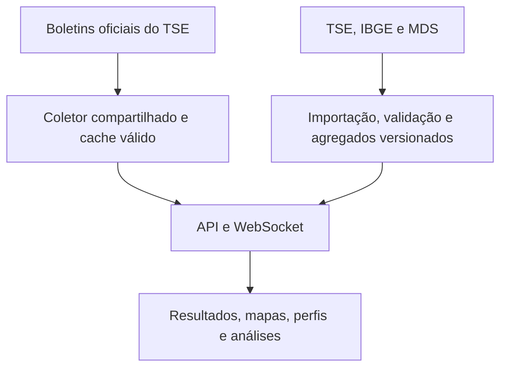

# Acompanhar Eleição

**Apuração ao vivo, mapas e contexto para entender as eleições brasileiras.**

Plataforma independente criada por **Murilo Rocha Silva**. Resultados oficiais se conectam ao perfil do eleitorado, candidaturas, campanha e histórico municipal, com fonte, período e granularidade visíveis.

[Acessar o site](https://acompanhareleicao.site) · [Conhecer o produto](docs/produto.md) · [Galeria em 4K](docs/galeria.md) · [Arquitetura e UML](docs/arquitetura.md) · [Metodologia](docs/metodologia.md)

> **Vitrine documental.** Este repositório reúne apresentação, diagramas e capturas reais. A implementação da aplicação permanece privada e não é distribuída aqui.

## O que é possível explorar

| Área | Experiência |
| --- | --- |
| **Ao vivo** | Presidente, governadores, Senado e deputados; votos, participação, seções e situação oficial, com atualizações compartilhadas |
| **Território** | Brasil, UFs, municípios e exterior; mapas, zoom, votação por candidato, vantagem e recortes locais |
| **Eleitorado** | Categorias oficiais, contagens e percentuais, biometria, acessibilidade e “não informado”, conforme cobertura |
| **Candidaturas** | Perfil público, retratos do próprio ano, bens, redes, trajetória, propostas e contas importadas |
| **Histórico municipal** | Prefeitos, vices e vereadores em oito eleições de 1996 a 2024, com turnos, vencedores oficiais e listas completas |
| **Contexto** | Censo, PIB e programas sociais agregados, com ano ou competência explícitos |
| **Comparação** | Localidades, partidos, participação e eleições comparáveis, com limites metodológicos visíveis |

A cidade permanece selecionada entre os temas. Detalhes se organizam por abas, filtros e perfis: painel lateral no desktop e tela inteira no celular. Favoritos dispensam cadastro obrigatório; o aplicativo usa PWA em dispositivos compatíveis. A consulta ocorre no site, sem opção de exportação.

## História, sem misturar referências

**1996 · 2000 · 2004 · 2008 · 2012 · 2016 · 2020 · 2024**

Prefeitura e Câmara municipal podem ser consultadas na mesma cidade e ano. A visão final escolhe o último turno disponível de cada município, sem somar turnos ou contar uma cidade duas vezes. Eleição vem da situação oficial do TSE; o vice integra a chapa e não possui votação individual.

O patrimônio municipal de 2024 reúne **911.162 bens em 296.130 candidaturas**, com total, categorias e referência. Ausência de declaração não significa patrimônio zero. Consulte a [cobertura](docs/cobertura.md) para saber quais dados, retratos e integrações estão disponíveis ou pendentes.

## Uma coleta compartilhada

React, Vite, GSAP, D3, TopoJSON, Node.js, WebSocket, Python e SQLite compõem a implementação privada. Resultados ao vivo e bases analíticas têm estratégias próprias de atualização.

Uma visita não dispara outra coleta de resultados no TSE. Jobs independentes preservam a versão válida anterior quando uma fonte falha. Os [diagramas UML](docs/arquitetura.md) mostram os fluxos, o domínio e a navegação. A [documentação de qualidade](docs/qualidade.md) registra os 122 testes, build e conferência visual da versão apresentada.

## Dados oficiais, leitura responsável

As fontes principais são **TSE, IBGE e MDS**. Cada indicador informa origem, período, atualização e abrangência territorial. Cadastro eleitoral, apuração, Censo e programas mensais não são a mesma referência.

> Análises demográficas são realizadas a partir de dados agregados territoriais. Elas não identificam nem permitem determinar como indivíduos ou grupos específicos votaram.

Correlação não prova causalidade. Patrimônio declarado não é renda. Contratação e pagamento permanecem separados. Campos ausentes não recebem números fictícios, e dados municipais não são distribuídos artificialmente por seção. Essas regras e os limites estão na [metodologia](docs/metodologia.md).

## Galeria original

**52 capturas em 4K nativo e 9 móveis**, com páginas e abas principais, recortes representativos e páginas longas completas. Os arquivos de desktop têm **3.840 pixels de largura**, sem ampliação artificial ou recompressão posterior.

- [Apuração, mapas e exterior](docs/galeria.md#apuração-mapas-e-análises)
- [Candidaturas e campanha](docs/galeria.md#candidaturas-e-campanha)
- [Prefeituras e câmaras municipais](docs/galeria.md#prefeituras-e-câmaras-municipais)
- [Interface no celular](docs/galeria.md#conferência-móvel)
- [Dimensões, horários e checksums](media/manifest.json)

Capturas da versão local de **05/10/2026 BRT**. Resultados são registros daquele instante; esta apresentação não afirma que todas as melhorias locais já estejam publicadas no domínio. Abra as imagens individuais para consultar em tamanho original.

## Conteúdo do repositório

`docs/` reúne produto, arquitetura, UML, metodologia, cobertura, qualidade e galeria. `media/` contém as capturas originais e o manifesto. `.gitignore` permite somente os arquivos documentais revisados; `.gitattributes` define o tratamento de texto e imagens.

Código da aplicação, histórico Git da implementação, bancos, caches, credenciais e configurações de infraestrutura permanecem fora desta vitrine. Consulte o [aviso de uso e autoria](NOTICE.md).

**Criado por Murilo Rocha Silva** · [Instagram @muriloodev](https://www.instagram.com/muriloodev/)

Projeto independente e politicamente neutro, sem vínculo ou chancela institucional das fontes oficiais.
