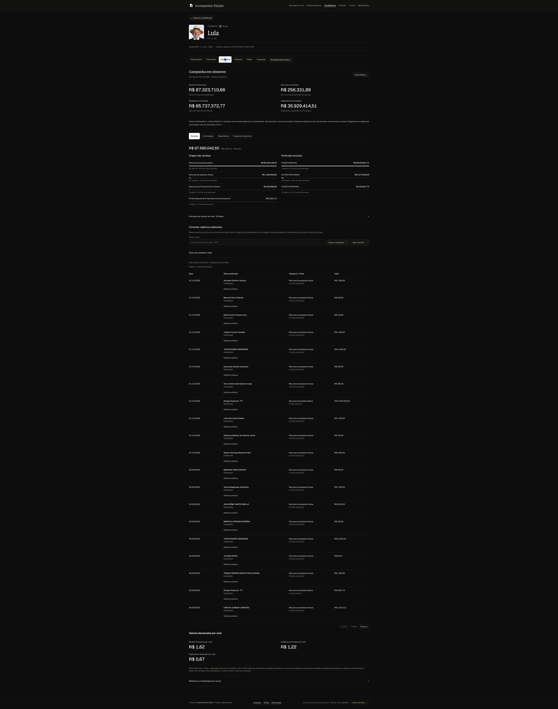

# Acompanhar Eleição

**O voto no mapa. O território em contexto.**

Resultados oficiais, candidaturas, campanhas e história eleitoral em uma plataforma brasileira de consulta e análise territorial.

[Abrir a plataforma](https://acompanhareleicao.site) · [Conhecer os recursos](docs/produto.md) · [Ver demonstrações em 4K](docs/galeria.md) · [Consultar a metodologia](docs/metodologia.md)

## Do Brasil à sua cidade

Acompanhe a apuração, explore municípios e exterior, consulte o perfil do eleitorado e descubra como uma localidade votou em outras eleições. A cidade permanece selecionada entre os temas.

| Pergunta | O que a plataforma oferece |
| --- | --- |
| Como está a apuração? | Resultados, mapas, votos, participação e atualizações oficiais compartilhadas em tempo real |
| Quem compõe o eleitorado? | Categorias cadastrais, contagens, percentuais, biometria e acessibilidade |
| Quem são as candidaturas? | Perfis públicos, retratos, chapa, bens, propostas, trajetória e contas disponíveis |
| Como esta cidade votou antes? | Presidência de 2022 e acervo de prefeitos e vereadores de 1996 a 2024, conforme cobertura |
| Qual é o contexto do território? | População do Censo, PIB municipal e programas sociais agregados, com referência temporal |
| Existe associação territorial? | Mapas de indicadores, dispersão, faixas por quantis e comparações explicadas, sem inferir voto individual |

[Conheça o explorador de indicadores](docs/explorar.md): renda média e mediana, faixas de renda, Bolsa Família, internet, saneamento e mais contexto territorial, com comparação de votação entre faixas de localidades.

[Veja a cobertura das fontes](docs/cobertura.md) para distinguir dados disponíveis e ampliações em investigação.

## Uma experiência de consulta

Mapas interativos, filtros compartilháveis, tabelas completas, perfis por tema e navegação responsiva. Favoritos dispensam cadastro; a instalação como PWA está disponível em dispositivos compatíveis.

## Dados oficiais, com contexto

As fontes principais são **TSE, IBGE e MDS**. Cada medida tem origem, período e abrangência. Um Censo, uma competência mensal e um boletim de apuração são referências distintas.

> Análises demográficas são realizadas a partir de dados agregados territoriais. Elas não identificam nem permitem determinar como indivíduos ou grupos específicos votaram.

Ausências permanecem indisponíveis. Correlação não demonstra causalidade. Patrimônio declarado não é renda. Dados municipais não são distribuídos artificialmente por seção.

[Metodologia](docs/metodologia.md) · [Cobertura](docs/cobertura.md) · [Arquitetura e diagramas UML](docs/arquitetura.md)

## Explore a demonstração

A galeria reúne capturas originais, com **3.840 pixels de largura no desktop**, além de telas móveis. Abra cada imagem para consultar em resolução nativa. Resultados e horários representam o instante da captura.

[Apuração e mapas](docs/galeria.md#apuração-mapas-e-análises) · [Campanhas](docs/galeria.md#candidaturas-e-campanha) · [Prefeituras e câmaras](docs/galeria.md#prefeituras-e-câmaras-municipais) · [Celular](docs/galeria.md#conferência-móvel)

## Sobre esta vitrine

Este repositório apresenta o produto, sua metodologia, diagramas e demonstrações. A implementação é privada. Código da aplicação, bases de dados, caches, credenciais e configurações de infraestrutura não fazem parte desta publicação.

**Criado por Murilo Rocha Silva** · [GitHub](https://github.com/murilolol) · [Instagram](https://www.instagram.com/muriloodev/)

Projeto independente e politicamente neutro, sem vínculo ou chancela institucional das fontes. [Aviso de uso e autoria](NOTICE.md).
