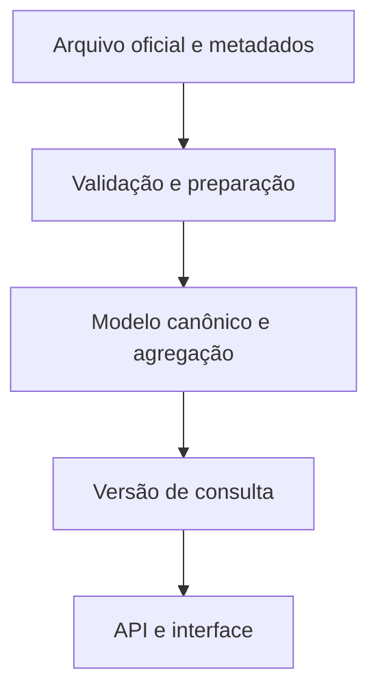

# Armazenamento e escalabilidade

O acervo separa originais de auditoria, preparação e versões prontas para consulta. A aplicação utiliza agregados publicados; não processa milhões de linhas a cada visita.

Snapshots imutáveis conservam identidade por checksum. Respostas compactadas mantêm o conteúdo original; leitores verificam integridade e usam cache local. A consulta de transações utiliza índices próprios.

O histórico e as estatísticas têm ciclos de atualização diferentes da apuração. Jobs independentes preservam a versão válida anterior quando uma fonte falha. O conjunto necessário ao servidor de consulta é distinto do ambiente que importa e audita as fontes.

Esse desenho permite crescer o acervo sem fazer cada visitante consultar diretamente as APIs governamentais. Capacidade final depende do volume, das referências mantidas e da margem necessária à operação.
