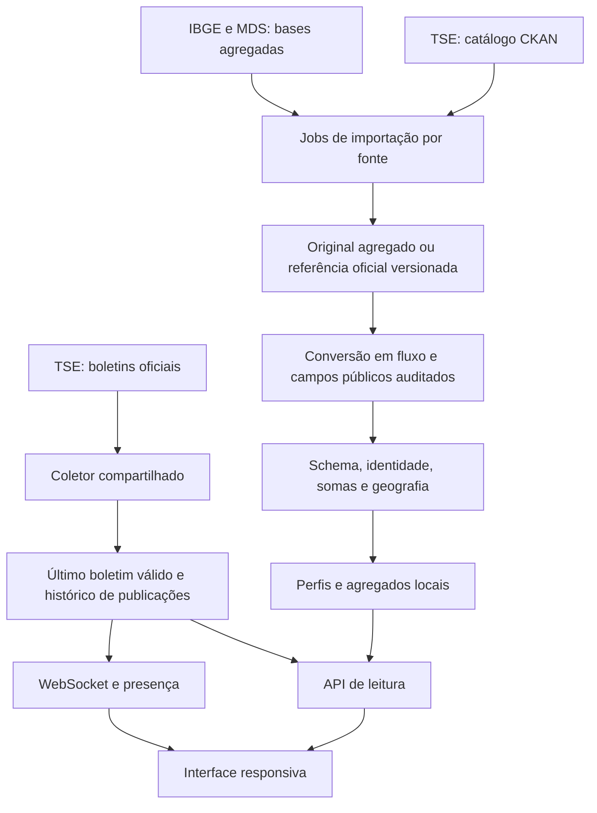
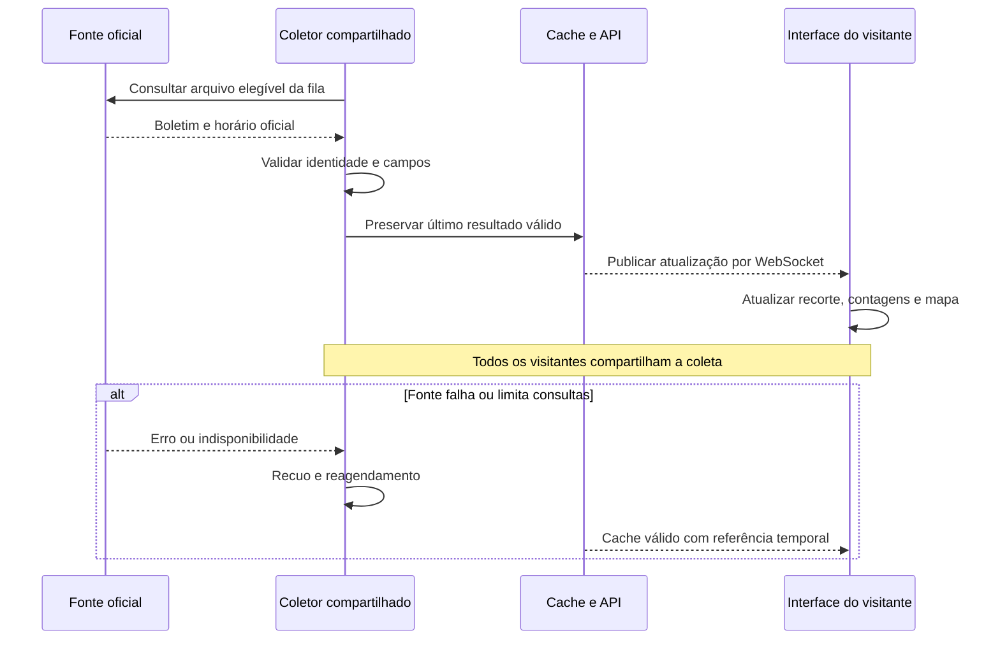
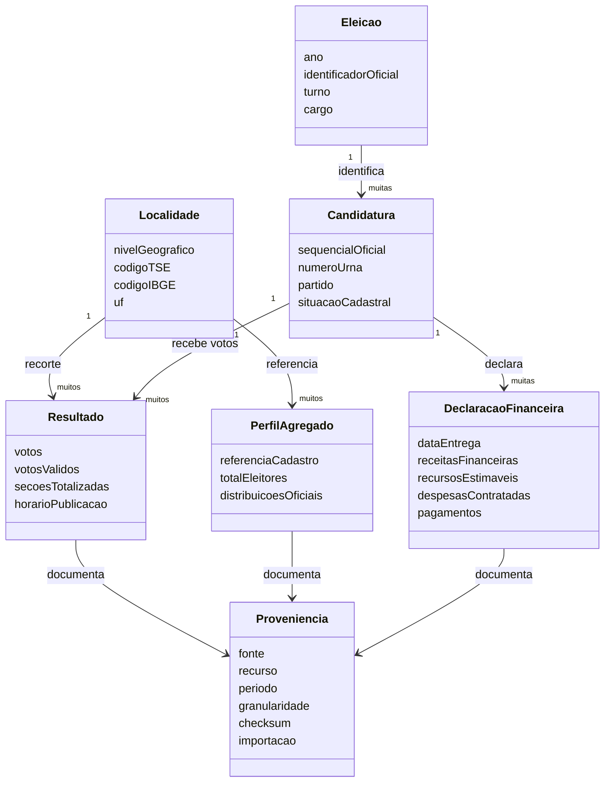
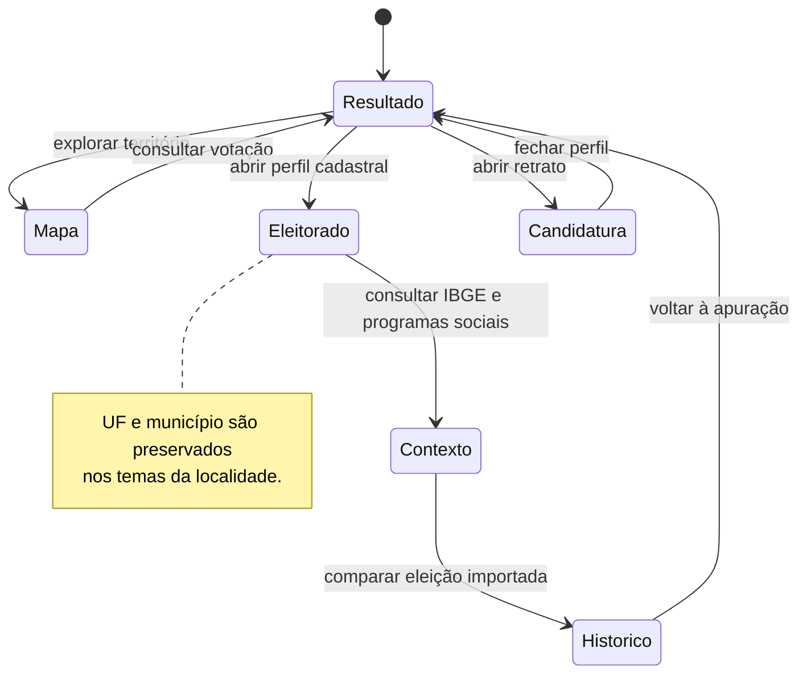
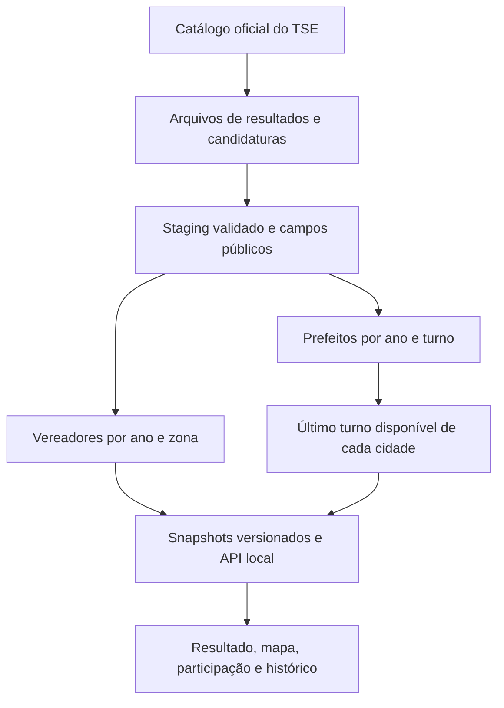

# Arquitetura da plataforma

O Acompanhar Eleição separa a apuração em tempo real das estatísticas cadastrais, históricas, mensais e censitárias. Este documento apresenta os contratos conceituais; não distribui a implementação ou instruções de acesso à infraestrutura.

## Visão geral

A visita de um usuário consulta o backend do projeto. Não dispara uma coleta independente de resultados no TSE. Fotografias têm cache próprio; dados analíticos são servidos de versões importadas e consultas financeiras indexadas.

## Fluxo de atualização — UML de sequência

O coletor consulta cada arquivo com intervalo mínimo de 13 segundos, em fila compartilhada e com limite global mais conservador. HTTP 429 suspende a coleta conforme o recuo e o `Retry-After`. Esses limites são uma estratégia do projeto, não uma afirmação de garantia de serviço da fonte.

## Domínio dos dados — UML conceitual

O diagrama descreve o domínio, não afirma que todo conceito é uma tabela SQL única. A persistência atual combina JSONs pré-calculados, SQLite indexado e referências versionadas. A identidade de candidatura conserva ano, eleição, turno, UF e sequencial oficial; números de urna ou nomes não bastam para relacionar pessoas entre eleições.

## Navegação — UML de estados

## Falhas independentes

Uma fonte analítica indisponível não elimina o boletim LIVE nem as outras fontes do perfil. Uma publicação inválida não substitui silenciosamente o último dado válido. As telas informam dados indisponíveis, divergências, referências temporais e cobertura parcial.

## Histórico municipal

Prefeitos e vereadores utilizam um pipeline separado da apuração de 2026. ZIPs oficiais passam por leitura em streaming, validação do schema e staging SQLite. Snapshots pré-calculados por eleição, município e zona são publicados por manifest versionado. A versão do adaptador participa do checksum, isolando reprocessamentos de um mesmo arquivo. A API serve o cache local; a visita de uma pessoa não dispara nova consulta de resultados ao TSE.

