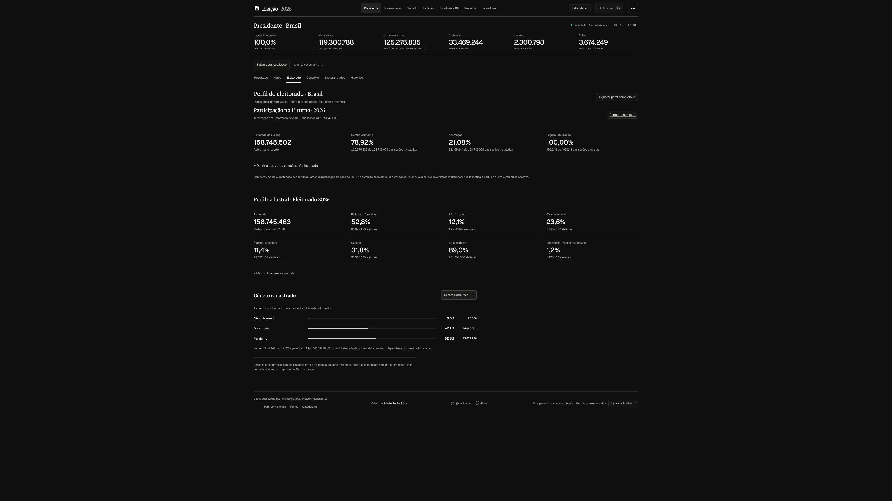

# Participação no primeiro turno de 2026

A aba **Eleitorado**, integrada à apuração, reúne o comparecimento e a abstenção do boletim oficial com o perfil cadastral da localidade. Brasil, estado e município mantêm seus próprios recortes; a cidade selecionada permanece na navegação.

[Abrir a aba na plataforma](https://acompanhareleicao.site/presidente?view=eleitorado)

## O que consultar

- Aptos nas seções totalizadas, comparecimento e abstenção, em quantidade e percentual.
- Votos válidos, brancos, nulos e outras classificações quando informadas pela fonte.
- Seções totalizadas, instaladas e não instaladas, quando disponíveis.
- Horário de publicação, recorte territorial e acesso à fonte oficial.

Os detalhes ficam recolhidos para preservar a leitura dos indicadores principais no computador e no celular. Ausências aparecem como indisponíveis.

## Denominadores distintos

O percentual oficial de comparecimento e abstenção usa o eleitorado das **seções instaladas**, conforme o layout EA20 do TSE. Ele não utiliza o total de um cadastro demográfico anterior. Percentuais das categorias de votos usam o total de votos do cargo; votos e pessoas não são medidas intercambiáveis, especialmente em cargos com mais de uma escolha.

Seções totalizadas e votação são grandezas distintas. Uma porcentagem arredondada de seções não deve ser interpretada como ausência de revisões ou novos boletins. A plataforma informa a referência da publicação e o status disponibilizado pelo TSE.

## Boletim e perfil cadastral

**Participação:** referência do boletim de resultados de 2026 do cargo e território consultados.

**Perfil cadastral:** referência própria do conjunto Eleitorado 2026. Gênero, idade, escolaridade e demais categorias não identificam como uma pessoa votou nem se compareceu.

Na consulta ao catálogo oficial em **6 de outubro de 2026**, não foi localizado o conjunto consolidado **Comparecimento e Abstenção — 2026** com segmentações por perfil. O site distingue os dados de participação já disponíveis no boletim da base por perfil ainda aguardada; dados de outro ano não são apresentados como 2026.

> Análises demográficas são realizadas a partir de dados agregados territoriais. Elas não identificam nem permitem determinar como indivíduos ou grupos específicos votaram.

Fonte: [Divulgação de resultados do TSE](https://resultados.tse.jus.br/) · [Layout oficial EA20](https://www.tse.jus.br/eleicoes/eleicoes-2026-content/arquivos/divulgacao-de-resultados/tse-ea20-arquivo-de-resultado-unificado) · [Portal de Dados Abertos](https://dadosabertos.tse.jus.br/).

[Metodologia](metodologia.md) · [Cobertura](cobertura.md) · [Galeria](galeria.md)
