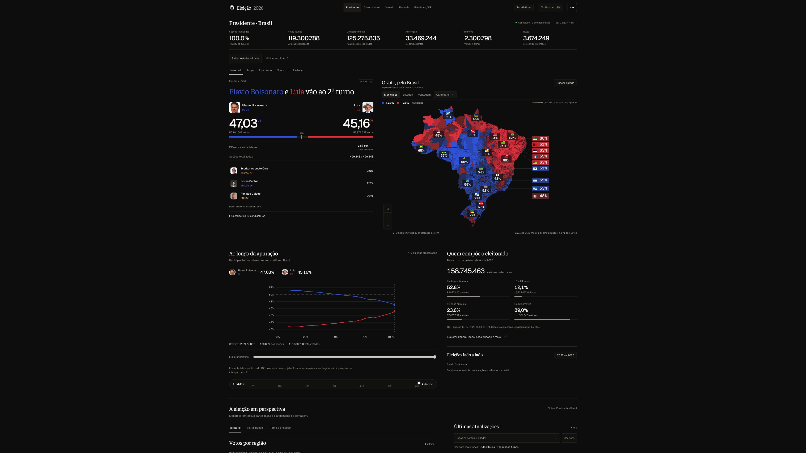
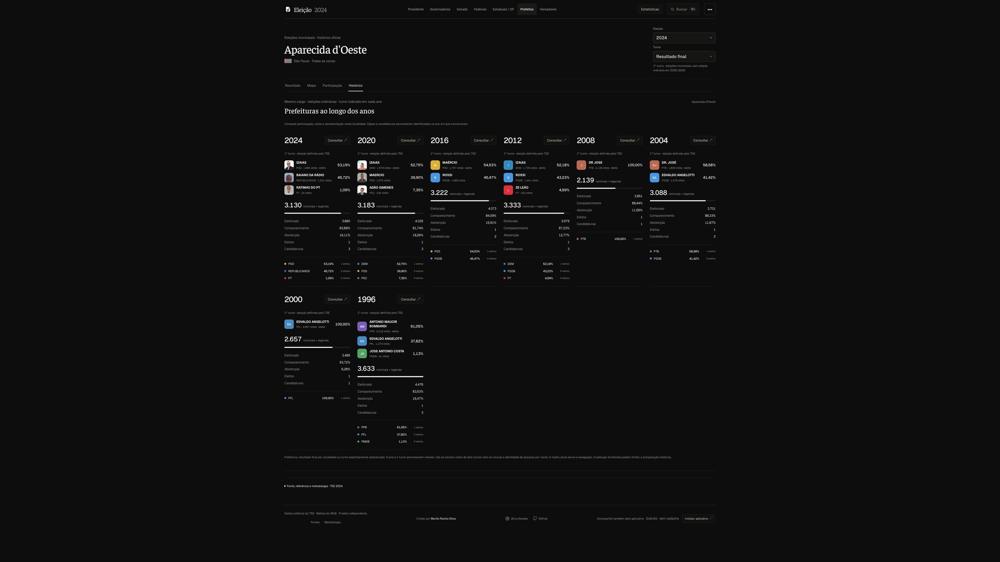
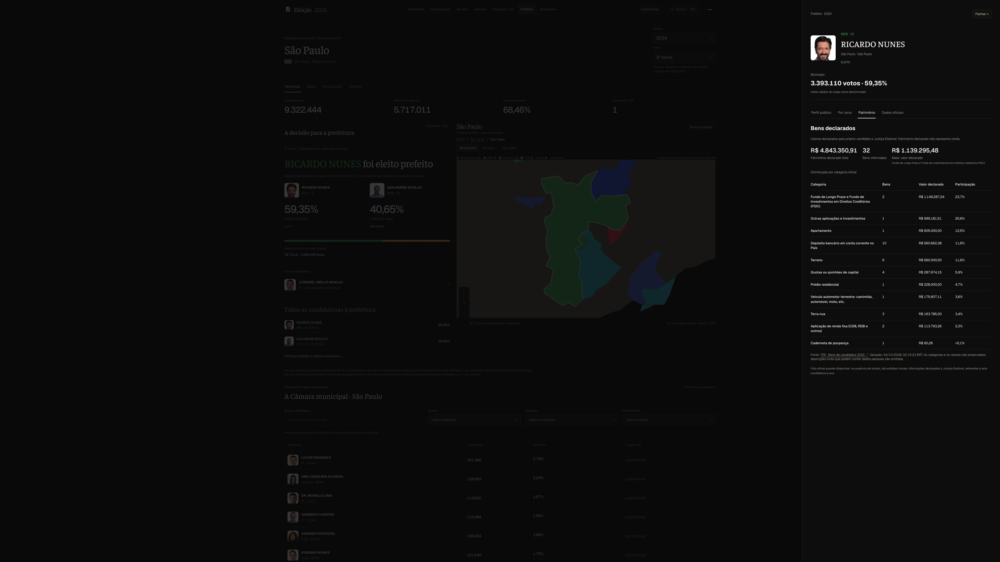
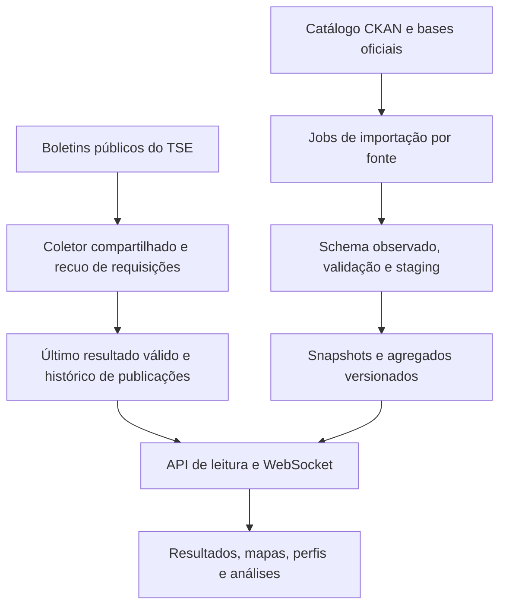

# Acompanhar Eleição

**Uma plataforma para acompanhar a votação e entender o território brasileiro.**

Apuração ao vivo, mapas interativos, perfil do eleitorado, candidaturas, campanha e histórico eleitoral em uma experiência responsiva. Projeto independente desenvolvido por **Murilo Rocha Silva**, com dados públicos oficiais e referência temporal visível.

[Acessar a plataforma](https://acompanhareleicao.site) · [Galeria em 4K](galeria.md) · [Arquitetura e UML](arquitetura.md) · [Fontes e metodologia](metodologia.md) · [Cobertura](cobertura.md)



> Este repositório é a **vitrine documental** do projeto: apresenta o produto, suas decisões técnicas e capturas reais. A implementação da aplicação permanece privada e não faz parte deste repositório.

## Do resultado ao contexto

O Acompanhar Eleição conecta a pergunta “como está a votação?” a outras: “quem compõe o eleitorado?”, “como esta cidade votou?”, “o que mudou entre eleições?” e “quais valores foram declarados pela candidatura?”.

A navegação preserva a localidade entre temas. Indicadores essenciais aparecem primeiro; detalhes, gráficos, tabelas e referências se organizam por abas. Dados sem cobertura permanecem indisponíveis, sem números demonstrativos.

| Experiência | O que permite consultar |
| --- | --- |
| **Apuração ao vivo** | Presidência, governadores, Senado e deputados; votos, participação, seções, situação oficial, boletins e presença conectada |
| **Brasil, estados e cidades** | Mapas municipais, liderança e vantagem em pontos percentuais, recortes territoriais e maiores eleitorados |
| **Exterior** | Mapa mundial, países e localidades eleitorais, bandeiras, percentuais e detalhes disponíveis |
| **Eleitorado** | Categorias oficiais de gênero, idade, escolaridade, estado civil, raça/cor, biometria e acessibilidade, conforme a cobertura |
| **Candidaturas** | Foto do próprio ano quando disponível, cadastro público, situação, patrimônio, redes, trajetória e propostas importadas |
| **Campanha** | Receitas, origens, contratações e pagamentos separados; transações filtráveis, categorias, valores e referência da entrega |
| **Prefeitos e vices** | Oito eleições municipais, de 1996 a 2024; vencedor oficial, composição das chapas, turnos e votos por zona |
| **Vereadores** | Todas as candidaturas da cidade, busca, partido, situação, paginação, distribuição dos votos e representação partidária |
| **Contexto municipal** | População, PIB e programas sociais agregados, com ano ou competência e denominador explícitos |
| **Histórico e comparação** | Participação, votação e mudanças entre referências comparáveis, sem confundir identidade de pessoas e partidos |

A consulta acontece no site, **sem opção de exportação**. Localidades e candidaturas podem ser acompanhadas por favoritos sem cadastro obrigatório. A instalação como aplicativo utiliza PWA em dispositivos compatíveis.

## Eleições municipais, com memória

Prefeitura e Câmara municipal são consultadas na mesma cidade e no mesmo ano. A situação de eleito vem do TSE; não é deduzida somente pela quantidade de votos. O vice integra a chapa e não possui votação individual.

**1996 · 2000 · 2004 · 2008 · 2012 · 2016 · 2020 · 2024**

O primeiro e o segundo turno permanecem separados. A visão final usa o último turno disponível de cada município, contando cada cidade uma vez. A série histórica informa o turno, votos, participação e referência em cada ano.



Resultados históricos não substituem a apuração atual. Retratos e biografias são vinculados à própria eleição; fotos ausentes não são preenchidas com imagens de outro ano. A base de 1996 possui incompletude informada pelo TSE.

## Transparência de candidaturas e valores

O perfil reúne informações publicáveis, votação territorial e declarações disponíveis, com tema e fonte separados. No desktop, abre em painel lateral; no celular, ocupa a tela.

Patrimônio declarado mostra quantidade de bens, total, maior valor e distribuição por categoria oficial. A carga municipal de 2024 contém **911.162 registros para 296.130 candidaturas** em 26 UFs. Ausência de declaração não significa patrimônio zero.



Nas contas de campanha, receitas financeiras, recursos estimáveis, contratações, pagamentos e doadores originários possuem papéis diferentes. O site preserva essa distinção, informa a entrega e não transforma os valores em ranking político de “melhor” ou “pior”. A cobertura financeira municipal histórica ainda depende de cargas próprias.

## Dados oficiais, interpretações responsáveis

| Referência | Uso na plataforma |
| --- | --- |
| **TSE** | Divulgação de resultados, cadastro eleitoral, candidaturas, bens, campanhas, locais de votação e arquivos históricos |
| **IBGE** | População do Censo e indicadores econômicos municipais |
| **MDS** | Indicadores públicos agregados de programas sociais |

Cada indicador conserva fonte, recurso, período, granularidade e atualização. Cadastro eleitoral, apuração, programas mensais e Censo são referências distintas. Um dado municipal não é artificialmente distribuído por zonas ou seções.

> Análises demográficas são realizadas a partir de dados agregados territoriais. Elas não identificam nem permitem determinar como indivíduos ou grupos específicos votaram.

Correlação não estabelece causalidade nem identifica o voto individual. Categorias “não informado” permanecem visíveis. Valores patrimoniais são declarações à Justiça Eleitoral e não representam renda. Totalizar 100% das seções não impede retificações posteriores.

A [metodologia](metodologia.md) explica os denominadores, as junções territoriais, a falácia ecológica e os limites. A [cobertura por módulo](cobertura.md) distingue dados importados e ampliações pendentes.

## Arquitetura: uma coleta compartilhada

Uma visita consulta a plataforma; não inicia outra coleta de resultados para cada pessoa. O backend compartilha a fila, valida publicações e transmite alterações por WebSocket. Bases históricas e analíticas são processadas previamente e servidas localmente.



**Interface:** React, Vite e GSAP. **Cartografia:** D3 e TopoJSON. **Serviços:** Node.js e WebSocket. **Dados:** Python, SQLite, streaming e snapshots versionados.

As fontes possuem jobs independentes. Uma falha conserva o dado válido anterior e informa a indisponibilidade. O intervalo de coleta e o recuo são estratégias do projeto, não promessas de disponibilidade das APIs oficiais.

Os [diagramas UML de sequência, domínio e navegação](arquitetura.md) detalham os contratos conceituais. A [qualidade da versão documentada](qualidade.md) registra a validação funcional e visual realizada.

## Uma interface para consultar, explorar e acompanhar

- Resultado e mapa equilibrados, com estatísticas compactas e detalhes por tema.
- Zoom pela roda do mouse e controles; no celular, um dedo preserva a rolagem da página e dois dedos manipulam o mapa.
- Atualizações e feedback visual de votos novos, com movimento reduzido respeitado.
- Filtros personalizados, referências compartilháveis na URL e listas completas de candidaturas.
- Rodapé no fluxo da página; perfis laterais no desktop e tela inteira no celular.
- Estados de carregamento, erro, ausência e divergência da fonte.

## Galeria original

**52 capturas em 4K nativo e 9 capturas móveis**, cobrindo páginas e abas principais, com recortes representativos. As páginas longas foram capturadas do cabeçalho ao rodapé; painéis e primeiras telas são identificados separadamente.

As imagens de desktop têm **3.840 pixels de largura**. Nenhuma captura foi ampliada artificialmente ou recomprimida depois de obtida do navegador. As dimensões, o tamanho, o horário em BRT e o SHA-256 constam no [manifesto das imagens](../media/manifest.json).

| Explore | Abrir documentação |
| --- | --- |
| Apuração, território e exterior | [Galeria de mapas e resultados](galeria.md#apuração-mapas-e-análises) |
| Candidaturas e campanha | [Galeria de perfis e valores](galeria.md#candidaturas-e-campanha) |
| Prefeituras e câmaras municipais | [Galeria municipal](galeria.md#prefeituras-e-câmaras-municipais) |
| Interface no celular | [Galeria móvel](galeria.md#conferência-móvel) |
| Arquitetura e decisões de dados | [Diagramas e UML](arquitetura.md) |

As capturas registram a versão local de **05/10/2026 BRT**. Os resultados são daquele instante; esta apresentação não afirma que todas as melhorias locais já estejam publicadas no domínio. Abra os arquivos individuais para ver a resolução original, pois a prévia do GitHub pode reduzir o tamanho exibido.

## O conteúdo desta vitrine

```text
README.md             Apresentação do produto
NOTICE.md             Autoria, uso e fontes
.gitignore            Lista restrita de arquivos documentais permitidos
.gitattributes        Texto e imagens com tratamento apropriado
 docs/
  arquitetura.md      Diagramas e UML conceitual
  cobertura.md        Disponibilidade real e pendências
  galeria.md          Capturas por página e aba
  metodologia.md      Fontes, fórmulas e limites
  qualidade.md        Validação da versão documentada
 media/
  manifest.json       Dimensões e checksums das capturas
  *.jpg               Capturas originais de desktop e celular
  marca.png           Símbolo do projeto
```

O código da aplicação, histórico Git da implementação, bancos, caches, credenciais e configurações de infraestrutura não são distribuídos aqui. A vitrine tem sua própria seleção de arquivos; `.gitignore` é uma proteção adicional, não substitui a revisão do conteúdo publicado.

## Autoria

**Murilo Rocha Silva** — desenvolvimento, experiência e evolução do Acompanhar Eleição.

[Plataforma](https://acompanhareleicao.site) · [Instagram @muriloodev](https://www.instagram.com/muriloodev/) · [GitHub @murilolol](https://github.com/murilolol)

Projeto independente e politicamente neutro. A utilização de dados oficiais não representa vínculo, endosso ou chancela das instituições de origem. Consulte o [aviso de uso](../NOTICE.md).
