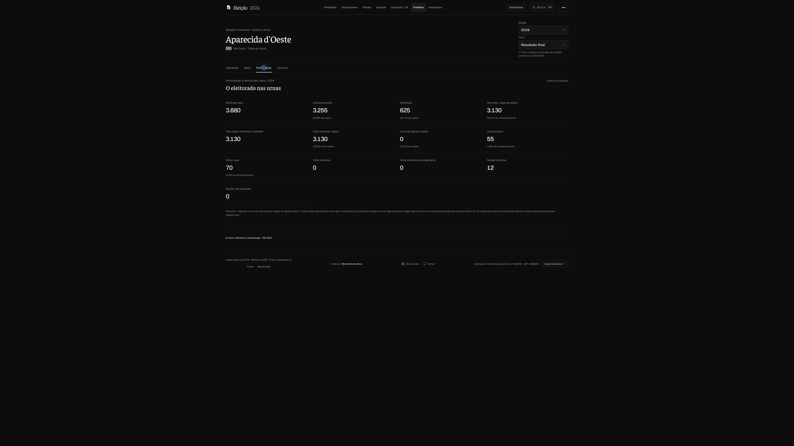

# Conheça o Acompanhar Eleição

Uma plataforma de consulta para acompanhar resultados e compreender o contexto territorial das eleições brasileiras.

## Resultados e território

Presidente, governadores, Senado e deputados têm resultados, votos, percentuais, mapas e recortes locais. O exterior possui mapa mundial e organização por país. Situação de eleição e segundo turno vêm das informações oficiais disponíveis.

A coleta é compartilhada: uma visita não inicia uma nova requisição ao TSE. As publicações conservam o horário da fonte e da consulta; revisões não são confundidas com novos votos.

## Perfil do eleitorado

O cadastro oficial permite consultar gênero, idade, escolaridade, estado civil e outras categorias efetivamente presentes. Contagens e percentuais aparecem juntos; “não informado” permanece no denominador. Biometria e acessibilidade conservam a definição da fonte.

## Candidaturas e campanha

Perfis organizam cadastro público, chapa, retratos, patrimônio declarado, redes, propostas e histórico disponíveis. Receitas e despesas têm referências próprias, filtros e detalhamento. Contratação e pagamento são medidas distintas. Documentos e identificadores pessoais desnecessários ficam ocultos.

## Histórico municipal

Prefeitos, vices e vereadores podem ser consultados em oito eleições: **1996, 2000, 2004, 2008, 2012, 2016, 2020 e 2024**. As candidaturas são pesquisáveis por nome, número e partido. Turnos permanecem separados e a situação oficial identifica quem foi eleito.

## Contexto e análises

População do Censo, PIB e programas sociais agregados acrescentam contexto. Fonte, ano ou competência e granularidade acompanham cada medida. A comparação territorial usa dispersão, Pearson, Spearman e faixas por quantis; não representa preferência individual nem prova causalidade.

O explorador integrado amplia essa consulta com mapas sincronizados, tabela filtrável e qualidade da referência. Sua documentação específica distingue a versão em demonstração e novas fontes em investigação.

## Uso no desktop e no celular

A localidade permanece selecionada entre temas. Indicadores essenciais aparecem primeiro; detalhes usam abas e perfis. Mapas têm controles de zoom, e a página mantém rolagem natural. Animações curtas comunicam mudanças e respeitam redução de movimento.

Favoritos funcionam sem cadastro obrigatório. O aplicativo pode ser instalado como PWA em dispositivos compatíveis. A consulta ocorre no site.

## Transparência

A [metodologia](metodologia.md) documenta cálculos, joins, denominadores e limites. A [cobertura](cobertura.md) identifica dados importados e ampliações pendentes. A [galeria](galeria.md) registra a experiência real; capturas são retratos de um instante.
